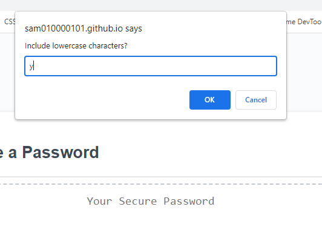

# password-generator
This is my random password generator

## Description 

The challenge was to create an application that an employee can use to generate a random password based on criteria they’ve selected by modifying starter code. 

This app will run in the browser, and features dynamically updated HTML & CSS powered by JavaScript code that I've writen. It has a clean and polished user interface that is responsive, ensuring that it adapts to multiple screen sizes.

I have learned and applied the following aspects as part of this challenge;

<ul> 
    <li><strong>Javascript objects</strong> - variable arrays with properties that can be traversed.</li> 
    <li><strong>Constants</strong> - use of variables to declare constants globally that can be recalled throughout code.</li>
    <li><strong>Prompts</strong> - code that produces a browser object that requires user input.</li>
    <li><strong>Alerts</strong> - code that produces a browser object that alerts the user of a defined message.</li>
<li><strong>The While Loop</strong> - a JS statement that loops through a block of code as long as a specified condition is true.</li>
<li><strong>1. Math.Random & 2. Math.floor</strong> - JS statements that 1. returns a random number 2. rounds down and returns the largest integer less than or equal to a given numbe </li>
</ul> 

### Result -  
<i>My password generator displays as intened on screens of varying sizes, as below;</i>

### Here is the deployed site; 
https://sam010000101.github.io/password-generator/

## Table of Contents

* [Installation](#installation)
* [Usage](#usage)
* [Credits](#credits)
* [License](#license)

## Installation

N/A

## Usage 
Hit the "Generate Password" button and you'll be greated with a request to specify you password length (must be between 10 & 64 characters, inclusive;

You'll then be prompted to choose which character types you would like your password to contain;

## Credits

This project was created in collaboration with my teamates, big shouts out to;
    <li>Paul Ashby https://github.com/paulashby</li>
    <li>Ian Cheng https://github.com/ian29012</li>

## License

MIT License

Copyright (c) 2022 Sam Brooke

Permission is hereby granted, free of charge, to any person obtaining a copy
of this software and associated documentation files (the "Software"), to deal
in the Software without restriction, including without limitation the rights
to use, copy, modify, merge, publish, distribute, sublicense, and/or sell
copies of the Software, and to permit persons to whom the Software is
furnished to do so, subject to the following conditions:

The above copyright notice and this permission notice shall be included in all
copies or substantial portions of the Software.

THE SOFTWARE IS PROVIDED "AS IS", WITHOUT WARRANTY OF ANY KIND, EXPRESS OR
IMPLIED, INCLUDING BUT NOT LIMITED TO THE WARRANTIES OF MERCHANTABILITY,
FITNESS FOR A PARTICULAR PURPOSE AND NONINFRINGEMENT. IN NO EVENT SHALL THE
AUTHORS OR COPYRIGHT HOLDERS BE LIABLE FOR ANY CLAIM, DAMAGES OR OTHER
LIABILITY, WHETHER IN AN ACTION OF CONTRACT, TORT OR OTHERWISE, ARISING FROM,
OUT OF OR IN CONNECTION WITH THE SOFTWARE OR THE USE OR OTHER DEALINGS IN THE
SOFTWARE

---

## Badges

## Tests

Final landing page deployed & fully functional 
(<i>see Results section above for screenshots</i>)

---

© 2022 Trilogy Education Services, LLC, a 2U, Inc. brand. Confidential and Proprietary. All Rights Reserved.
# Password-Generator

